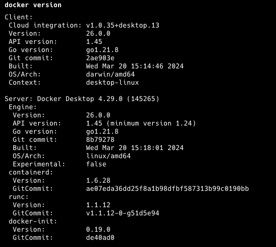
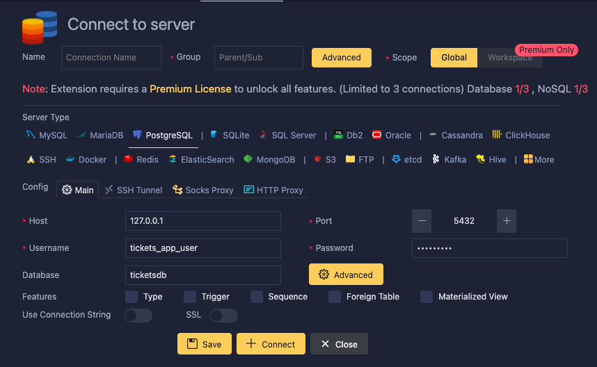
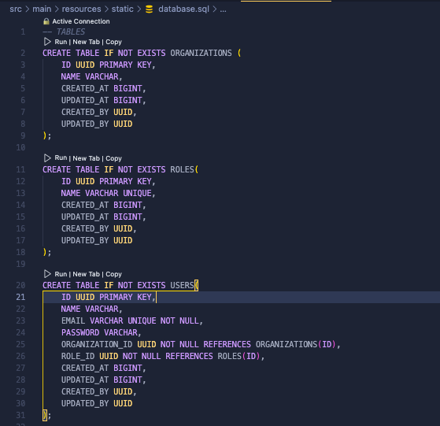

# HelpDeskApi (Sistema de Tickets)

## Descripción del Sistema

Aplicación utilizada para gestionar y rastrear incidencias, solicitudes, y tareas en una organización.

Proyecto impartido por [Pixabyte](<https://www.pixabyte.com>) Mentor: Raul Vivanco

### Requisitos previos

- Se debe tener instalado Git para realizar la descrga del repositorio. Si no lo tienes aca te dejo el link: <https://git-scm.com/downloads>
- Se debe tener instaldo Docker Desktop para realizar el despliegue y realizar las pruebas del desafio. Si no lo tienes aca te dejo el link:
  * Mac  
<https://docs.docker.com/desktop/install/mac-install>

  * Windows  
<https://docs.docker.com/desktop/install/windows-install>

## Instalacion

Para descargar el repositorio debe pinchar el boton code en esta pagina y copiar el enlace, de igual forma aca te dejo el comando para realizarlo, bien sea que lo realices del repositorio del curso o de mi repositorio.
Este comando debe realizarlo desde una ventana de comando.

* ### Repositorio Github del curso
    <https://github.com/Pixabyte-Corporation/helpdek-java-api>

    <pre><code>git clone https://github.com/Pixabyte-Corporation/helpdesk-java-api.git
    </pre></code>

* ### Mi Repositorio Github del curso
    <https://github.com/reyacacio/helpdesk-java-api>

    <pre><code>git clone https://github.com/reyacacio/helpdesk-java-api.git
    </pre></code>

    Una vez clonado el repositorio, en el directorio que realizaste la clonacion encontraras un directorio que identifica el aplicativo.

    Debemos ingresar a el directorio helpdeskapi y alli encotraras varias directorios y archivos, desde una terminal de comando, debemos ingresar a dicho directorio para ello te colocare un ejemplo.

    Asumamos que el directorio que elegiste para realizar la clonacion se encuentra en
    c:/java , deber ingresar al directorio helpdeskapi con los siguientes comandos.

    Este comando nos llevara a ingresar al directorio java.
    <pre><code>cd java</code></pre>

    Luego debemos ingresar a el directorio helpdeskapi con el siguiente comando.
    <pre><code>cd helpdeskapi</code></pre>

    Debemos tener instalado el docker desktop para poder realizar la instalacion del postgreSql en el contenedor de docker, para verificar si esta instalado debemos ejecutar el siguiente comando en una terminal de comando.
    <pre><code>docker version</code></pre>

    si todo va ok, deberias obtener una respuesta como la siguiente imagen
    

    Ahora que hemos verificado que tenemos docker instalado y funcionando procedemos a realizar la ejecucion del comando docker-compose, el cual realizara la descarga de la imagen y ejecutar el postgreSql.
    El comando que utilizaremos es el siguinte.
    <pre><code>docker-compose up -d</code></pre>

    Una vez terminado la dockerizacion del postgreSql, podemos acceder desde un administrador de base de datos.

    Existe varios administradores para PosgreSql entre los mas polulares estan.
    * [pgAdmin](<https://www.pgadmin.org/download/>)
    * [dbeaver](<https://dbeaver.io/download>)
    * [HeidiSQL](<https://www.heidisql.com/download.php>)

    En mi caso utilizo un plugins de VSCode el cual les comparto
    * [Database Client JDBC](<https://marketplace.visualstudio.com/items?itemName=cweijan.dbclient-jdbc>)

    Se realiza la conexion a la Base de Datos de PosgreSql, ingresando las credenciales de username, password y database las cuales se encuentra en el documento docker-compose.yml

    

    En la carpeta resource/static se encuentra una archivo llamado database.sql en el cual se encuentra las sentencias para la creacion de las tablas (Organizations, Roles, Users) y la insersion de los datos a dichas tablas.

    

    Ahora podemos ejecutar nuestra aplicacion y realizar las pruebas desde PostMan, Insomnia o cualquier tester de APIs de su preferencia.
    el link de nuestra aplicacion sera el siguiente http://localhost:8080

* ## Cierre de ejecucion de las imagenes

    Para cerrar la ejecucion de nuestra imagen de PostgreSql ejecutamos el comando.

    <pre><code>docker-compose down</code></pre>

### Utilidades
* ### Instaladores de Testing APIs
  * [Postman](<https://www.postman.com/downloads>)
  * [Insomnia](<https://insomnia.rest/download>)

* ### Generador de UUID
    <https://www.uuidgenerator.net>

* ### Revisar JWT
    <https://jwt.io>

* ### Utils
    <https://www.vaultproject.io>
